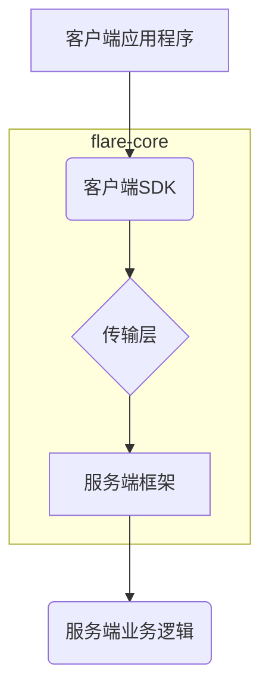

# 架构摘要

本文档概述了`flare-core`项目的核心架构设计，这是一个为长连接IM通信设计的可插拔、高性能的通信基座。

## 核心原则

- **协议无关**: 核心逻辑与底层传输协议（WebSocket、QUIC、TCP）解耦。
- **可扩展性**: 通过插件和可配置模块轻松扩展功能。
- **高性能**: 针对低延迟和高并发进行了优化。

## 核心架构分层

系统分为以下几个核心层次：

1.  **传输层 (`transport`)**: 提供一个统一的`Connection`接口，并为WebSocket、QUIC和TCP提供具体的实现。工厂模式将用于在运行时动态选择传输方式。

2.  **公共核心模块 (`common`)**: 包含所有层次共享的核心功能，例如：
    - **消息协议**: 消息信封的定义、序列化（Protobuf/JSON）和反序列化。
    - **连接管理**: 心跳、自动重连和连接状态机。

3.  **客户端SDK (`client`)**: 为应用开发者提供一个易于使用的库，用于连接到`flare-core`服务器。它将处理连接管理、消息路由和QoS。

4.  **服务端框架 (`server`)**: 一个可扩展的框架，用于构建`flare-core`服务器。它将包括：
    - **连接网关**: 处理大量并发连接、身份验证和安全性。
    - **消息路由**: 支持发布/订阅、点对点和群组消息传递。
    - **集群支持**: 实现节点发现和一致性哈希，以实现可伸缩性。

## 模块关系图

