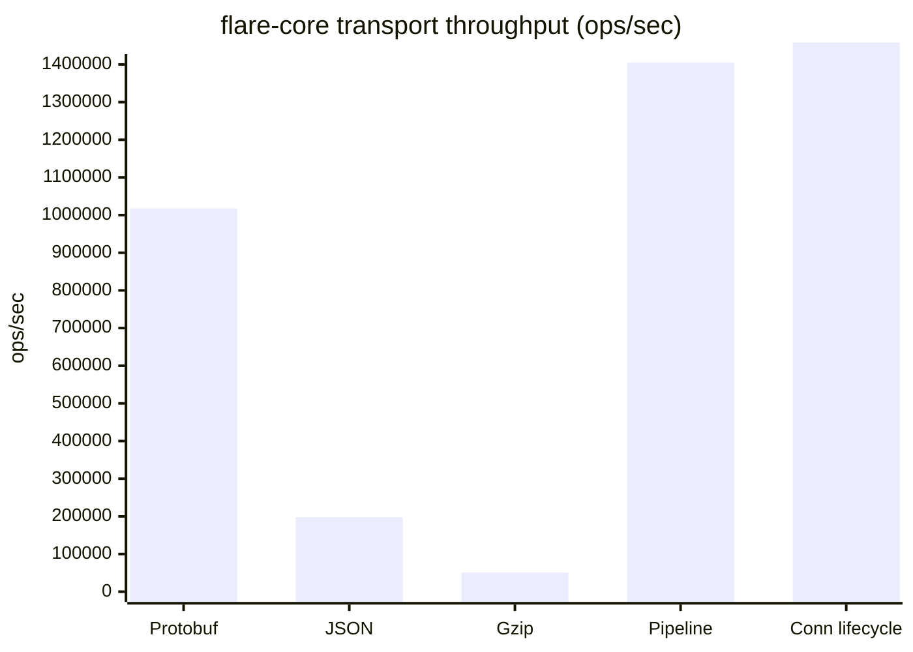
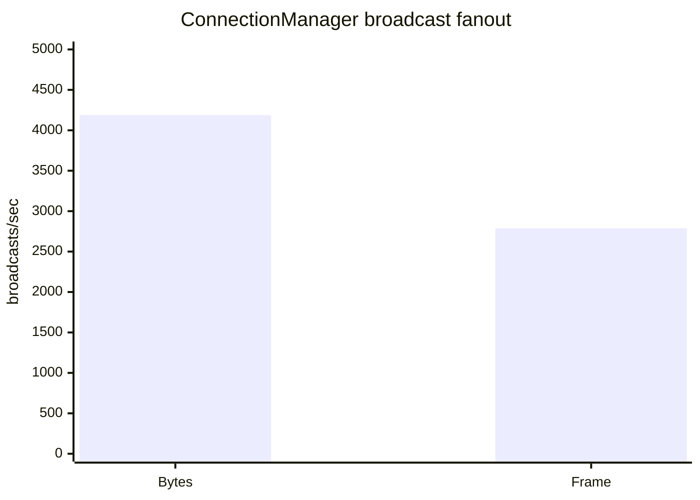

# Flare Core

[](https://crates.io/crates/flare-core)
[](https://docs.rs/flare-core)
[](LICENSE)
[](https://www.rust-lang.org/)
[](https://github.com/flare-im/flare-core)

[](https://github.com/flare-im/flare-core)
[](https://github.com/flare-im/flare-core)
[](https://github.com/flare-im/flare-core)
[](https://tokio.rs/)
[](https://github.com/flare-im/flare-core)
[](https://github.com/flare-im/flare-core)
[](https://github.com/flare-im/flare-core)

Rust 长连接通信库（Tokio async），面向即时通讯、聊天室与实时推送。支持 WebSocket、QUIC、TCP，以及 Protobuf/JSON 协商、压缩加密、心跳重连、多设备策略与 Token 认证。

英文 API 文档：[docs.rs/flare-core](https://docs.rs/flare-core)

## 特性

- **传输**：WebSocket（含 TLS）、QUIC；Native 客户端支持多协议竞速（Hybrid）；TCP 需 `--features tcp`
- **协商**：Protobuf / JSON；Gzip / Zstd；CONNECT → CONNECT_ACK → NEGOTIATION_READY
- **连接**：协商完成后心跳、活跃检测、自动重连、设备冲突策略
- **构建模式**：`ClientBuilder` / `ServerBuilder`（闭包）、Observer、Flare（生产推荐）
- **扩展**：可注册自定义序列化器、压缩器、加密器

## 依赖引入

当前版本见 [`Cargo.toml`](Cargo.toml)（crates.io 或 monorepo `path` 均可）。

```toml
# 默认：Native 客户端 + 服务端，WebSocket + QUIC + Gzip + AES-GCM
[dependencies]
flare-core = "0.1.3"
```

```toml
# 仅服务端（网关 / 接入层）
flare-core = { version = "0.1.3", default-features = false, features = [
    "server", "websocket", "quic", "compression-gzip", "encryption-aes-gcm",
] }

# 仅 Native 客户端
flare-core = { version = "0.1.3", default-features = false, features = [
    "client", "websocket", "quic", "compression-gzip", "encryption-aes-gcm",
] }

# 启用 TCP，或一次性全开
flare-core = { version = "0.1.3", features = ["tcp"] }
# flare-core = { version = "0.1.3", features = ["full"] }

# WASM / Web 客户端
flare-core = { version = "0.1.3", default-features = false, features = ["wasm"] }
# cargo build --target wasm32-unknown-unknown --no-default-features --features wasm
```

### Cargo Features

| Feature | 默认 | 说明 |
|---------|:----:|------|
| `client` | ✓ | 客户端连接、协商、重连与发送 |
| `server` | ✓ | Native 服务端接入与连接管理 |
| `websocket` | ✓ | WebSocket transport |
| `quic` | ✓ | Native QUIC transport |
| `tcp` | | TCP + length-prefixed Frame |
| `wasm` | | wasm32 客户端栈（`client` + `websocket` + 编解码） |
| `compression-gzip` | ✓ | Gzip 压缩 |
| `encryption-aes-gcm` | ✓ | AES-256-GCM 加密 |
| `full` | | 默认能力 + `tcp` |

运行时可通过 `flare_core::common::FeatureSet::current()` 查看当前构建能力。

## 架构

```
Application   ServerEventHandler · MessageListener · Authenticator
      ↓
Core          ServerCore / ClientCore · ConnectionManager · 消息管道 / 中间件
      ↓
Transport     HybridServer / HybridClient · WebSocket · QUIC · TCP
```

**连接生命周期**

1. 建立传输连接（WS / QUIC / TCP）
2. CONNECT 协商：序列化格式、压缩、加密
3. CONNECT_ACK → 双方解析器对齐 → NEGOTIATION_READY
4. 启动心跳，进入消息收发
5. 断开 / 重连（客户端可配置策略）

**构建模式**

| 模式 | Builder | 实现方式 | 适用 |
|------|---------|----------|------|
| Simple | `ServerBuilder` / `ClientBuilder` | 闭包 | 原型、最小接入 |
| Observer | `Observer*Builder` | `ServerEventHandler` / `ConnectionObserver` | 多协议、连接观察 |
| Flare | `FlareServerBuilder` / `FlareClientBuilder` | trait + 消息管道 | **生产推荐** |

## 快速开始

最小服务端（Flare 模式）：

```rust
use async_trait::async_trait;
use flare_core::common::protocol::{Frame, PayloadCommand};
use flare_core::server::events::handler::ServerEventHandler;
use flare_core::server::FlareServerBuilder;
use std::sync::Arc;

struct Handler;

#[async_trait]
impl ServerEventHandler for Handler {
    async fn handle_message(
        &self,
        _command: &PayloadCommand,
        _connection_id: &str,
    ) -> flare_core::common::error::Result<Option<Frame>> {
        Ok(None)
    }
}

#[tokio::main]
async fn main() -> flare_core::common::error::Result<()> {
    let server = FlareServerBuilder::new("0.0.0.0:8080", Arc::new(Handler)).build()?;
    server.run().await
}
```

**联调聊天室**（推荐从这里上手）：

```bash
# 终端 1：服务端
RUST_LOG=info cargo run --example flare_chat_server

# 终端 2：客户端（协议竞速 WS + QUIC）
RUST_LOG=info cargo run --example flare_chat_client -- user1

# TCP 联调（需 --features tcp）
cargo run --example flare_chat_server --features tcp
RUST_LOG=info cargo run --example tcp_client --features tcp
```

更多示例（Simple / Observer / QUIC / WASM / 自定义扩展）见 **[`examples/README.md`](examples/README.md)**。

## Native / WASM

| 能力 | Native | WASM |
|------|:------:|:----:|
| WebSocket 客户端 | ✅ | ✅ |
| QUIC 客户端 | ✅ | ❌ |
| TCP 客户端 | ✅（`tcp`） | ❌ |
| 多协议竞速（Hybrid） | ✅ | ❌ |
| `FlareClientBuilder` | ✅ | ✅（WS + 消息管道） |
| `HybridServer` / QUIC 服务端 | ✅ | ❌ |
| 协商后心跳 | ✅ | ✅ |

WASM 侧使用 `FlareClientBuilder::build_with_race`，连接状态请用 `is_connected_async`。本地 E2E 建议：

```bash
FLARE_WS_ONLY=1 cargo run --example flare_chat_server
```

浏览器示例见 `examples/wasm_websocket_client/`。

## 质量门禁

在 `flare-core` 目录执行：

```bash
./scripts/verify.sh
```

| 步骤 | 内容 |
|------|------|
| fmt | `cargo fmt --check` |
| clippy | lib，`deny warnings` |
| 测试 | native 单元 / 集成；`no-default-features` |
| feature 矩阵 | client/server × websocket/quic/tcp 编译检查 |
| wasm32 | `cargo check --target wasm32-unknown-unknown` |
| 示例 | `cargo build --examples` |

## 性能基线（传输层）

仅覆盖 Frame 编解码、消息管道、连接生命周期与内存 fanout，**不含** IM 语义（seq / sync / push 等）。完整报告：[`docs/performance-baseline.md`](docs/performance-baseline.md)

### 测试环境（硬件 / 软件）

| 项 | 配置 |
|----|------|
| CPU | Apple M1 Pro（ARM64），10 核 |
| 内存 | 16 GiB |
| 系统 | macOS Darwin 25.3.0 |
| Rust | 1.94.1 · Cargo 1.94.1 |
| 编译 | `--release`，单进程 benchmark，无额外负载 |

> 以上为跑基准时的**实测机器配置**，用于结果对照；`flare-core` 本身无固定硬件门槛，实际吞吐会随 CPU 架构、核数、内存带宽与并发连接数变化。跨环境对比时请固定 release 模式并记录 CPU/内存规格。

### 结果摘要

| Benchmark | 吞吐 |
|-----------|-----:|
| Protobuf 256B round-trip | 1,017,824 ops/s |
| JSON 256B round-trip | 197,954 ops/s |
| Protobuf+Gzip 1KB round-trip | 51,015 ops/s |
| Pipeline parse + validation | 1,405,371 ops/s |
| Connection add + active + remove | 1,457,953 ops/s |
| Broadcast 1,000 × 256B | ~4,188 broadcasts/s |
| Broadcast Frame 1,000 × 256B（显式 parser） | ~2,789 broadcasts/s |
| Timeout cleanup 1,000 connections | ~0.727 ms/op |





```bash
cargo bench --bench perf_baseline
```

**结论**：默认传输帧用 Protobuf；小消息慎用 Gzip；连接管理器 fanout 已改为发送前快照连接句柄，Frame fanout 在显式 parser 场景会单次序列化并批量更新活跃时间。超时清理按连接/用户分片批量移除，避免超时风暴下反复查表。配置共享 middleware / processor 时，ServerCore 会按协商 profile 复用 MessagePipeline，降低大量长连接的重复分配。Broadcast 项为内存 mock 连接 fanout，不代表真实网络带宽；真实瓶颈通常会转移到 socket 写队列、背压与慢消费者处理。

## 文档

| 资源 | 说明 |
|------|------|
| [`examples/README.md`](examples/README.md) | 示例列表、启动命令、模式对比 |
| [docs.rs](https://docs.rs/flare-core) | API 参考 |
| [`docs/performance-baseline.md`](docs/performance-baseline.md) | 性能基线详情 |
| `doc/` | 各构建模式补充说明 |

## 许可

[MIT License](LICENSE)。问题反馈：[GitHub Issues](https://github.com/flare-im/flare-core/issues)
