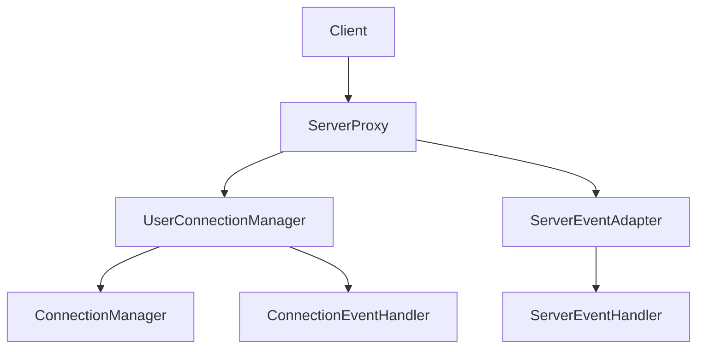

# 服务端连接管理与消息处理完整方案

## 1. 概述

本文档详细描述了服务端连接管理与消息处理的完整方案，包括连接生命周期管理、用户认证机制、消息处理流程等核心功能模块。

## 2. 架构设计

### 2.1 核心组件

1. **ConnectionManager**: 基础连接管理器，负责管理所有连接的基础生命周期
2. **UserConnectionManager**: 用户连接管理器，在基础连接管理器之上增加了用户维度的管理功能
3. **ServerEventAdapter**: 服务端事件适配器，专门用于适配服务端事件处理
4. **ServerProxy**: 服务端代理，提供统一的服务端接口，融合连接生命周期管理和服务端事件处理

### 2.2 模块关系图



## 3. ServerProxy融合代理设计

### 3.1 设计目标

ServerProxy作为融合功能的代理，需要整合以下功能：
1. 连接生命周期管理
2. 服务端事件处理
3. 用户认证与多端控制
4. 消息路由与处理

### 3.2 核心接口

```rust
pub struct ServerProxy {
    connection_manager: UserConnectionManager,
    event_adapter: ServerEventAdapter,
}

impl ServerProxy {
    pub fn new() -> Self { /* ... */ }
    
    // 连接管理接口
    pub async fn handle_new_connection(&self, connection: Connection) { /* ... */ }
    pub async fn handle_connection_close(&self, connection_id: ConnectionId) { /* ... */ }
    
    // 事件处理接口
    pub async fn handle_server_event(&self, event: ServerEvent) { /* ... */ }
    pub async fn handle_connection_event(&self, event: ConnectionEvent) { /* ... */ }
    
    // 用户管理接口
    pub async fn authenticate_user(&self, token: &str) -> Result<UserId, AuthError> { /* ... */ }
    pub async fn bind_user_to_connection(&self, user_id: UserId, connection_id: ConnectionId) { /* ... */ }
}
```

## 4. 连接全生命周期管理

### 4.1 生命周期阶段

1. **连接建立阶段**
   - 接收新连接
   - 创建连接对象
   - 注册到连接管理器

2. **认证阶段**
   - 等待认证信息
   - 验证用户身份
   - 绑定用户与连接

3. **活跃阶段**
   - 心跳检测
   - 消息处理
   - 状态监控

4. **断开阶段**
   - 正常断开处理
   - 异常断开检测
   - 资源清理

### 4.2 不同位置的处理情况

1. **WebSocket连接处理**
   - 在WebSocket服务端处理连接初始化
   - 分离读写流以支持并发操作
   - 注册WebSocket特定事件处理器

2. **QUIC连接处理**
   - 处理QUIC协议特定的连接建立流程
   - 注册QUIC特定事件处理器

3. **连接异常处理**
   - 网络中断检测
   - 超时处理
   - 自动重连机制

## 5. 事件处理机制

### 5.1 连接事件处理

- 连接建立事件：注册连接到管理器
- 连接断开事件：从管理器移除连接
- 连接异常事件：触发异常处理流程

### 5.2 服务端事件处理

- 用户登录事件：更新用户连接状态
- 用户登出事件：清理用户相关资源
- 消息处理事件：路由到相应处理器

## 6. 整合方案

### 6.1 连接生命周期与事件处理的整合

1. **连接建立时**：
   - ConnectionManager创建连接对象
   - ServerEventAdapter处理连接建立事件
   - 注册连接事件处理器

2. **认证完成时**：
   - UserConnectionManager绑定用户与连接
   - ServerEventAdapter处理用户登录事件

3. **消息处理时**：
   - Connection接收消息
   - ServerEventAdapter分发消息到相应处理器

4. **连接断开时**：
   - ConnectionManager清理连接资源
   - ServerEventAdapter处理连接断开事件
   - UserConnectionManager解绑用户与连接

### 6.2 ServerProxy协调流程

```rust
// 新连接处理流程
async fn handle_new_connection(&self, raw_connection: RawConnection) {
    // 1. 创建连接对象
    let connection = Connection::new(raw_connection);
    
    // 2. 注册到连接管理器
    self.connection_manager.register_connection(connection.clone()).await;
    
    // 3. 处理连接建立事件
    self.event_adapter.handle_connection_event(
        ConnectionEvent::Connected(connection.id())
    ).await;
    
    // 4. 启动连接处理任务
    self.spawn_connection_task(connection);
}

// 消息处理流程
async fn handle_message(&self, connection_id: ConnectionId, message: Message) {
    // 1. 获取连接
    if let Some(connection) = self.connection_manager.get_connection(connection_id).await {
        // 2. 处理消息事件
        self.event_adapter.handle_server_event(
            ServerEvent::MessageReceived { connection_id, message }
        ).await;
    }
}
```

## 7. 用户认证与多端控制

### 7.1 认证流程整合

1. 客户端发送认证请求
2. ServerProxy验证认证信息
3. UserConnectionManager绑定用户与连接
4. ServerEventAdapter处理登录事件

### 7.2 多端在线控制

1. 限制用户最大在线设备数
2. 自动断开超限的旧连接
3. 通知客户端连接被顶替

## 8. 代码示例

### 8.1 ServerProxy使用

```rust
let server_proxy = ServerProxy::new();

// 处理新WebSocket连接
server_proxy.handle_new_connection(websocket_connection).await;

// 处理服务端事件
server_proxy.handle_server_event(server_event).await;
```

### 8.2 事件处理链

```rust
// 连接事件处理链
ConnectionEvent -> ServerEventAdapter -> ConnectionEventHandler

// 服务端事件处理链
ServerEvent -> ServerEventAdapter -> ServerEventHandler
```

## 9. 最佳实践

1. 使用ServerProxy作为统一入口协调所有操作
2. 合理分离关注点，各组件职责单一
3. 实现有效的心跳检测机制
4. 正确处理异常断开情况
5. 及时清理无效连接资源
6. 控制用户多端在线数量

## 10. 性能优化建议

1. 使用连接池管理连接
2. 异步处理消息避免阻塞
3. 合理设置缓冲区大小
4. 使用高效的序列化方式
5. 实现连接复用机制