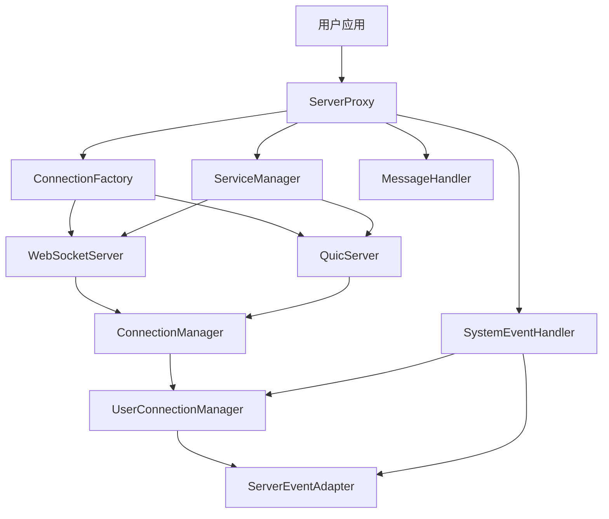

# 服务代理方案设计文档

## 1. 概述

本方案旨在提供一个统一的服务代理层，包装现有的基础服务（WebSocket、QUIC等），为用户提供连接和消息的全面处理能力。用户只需关注业务消息处理，而无需关心底层连接管理、认证、心跳等细节。

## 2. 设计目标

1. **透明包装**：在不修改现有基础服务的前提下，提供统一的服务代理接口
2. **简化使用**：用户只需实现消息处理器，无需关心连接生命周期管理
3. **可扩展性**：支持未来添加新的协议和服务
4. **高性能**：保持原有服务的性能特性
5. **可定制化**：保留原有服务的可定制化能力

## 3. 架构设计

### 3.1 核心组件

1. **ServerProxy**：核心代理类，整合所有服务功能
2. **MessageHandler**：用户实现的消息处理器接口
3. **SystemEventHandler**：系统事件处理器，处理内部系统事件
4. **ConnectionFactory**：连接工厂，用于创建不同类型的服务
5. **ServiceManager**：服务管理器，管理所有运行的服务

### 3.2 组件关系图



## 4. 核心接口定义

### 4.1 MessageHandler - 消息处理器

用户只需实现此接口来处理业务消息：

```rust
/// 用户消息处理器
#[async_trait::async_trait]
pub trait MessageHandler: Send + Sync {
    /// 处理用户消息
    async fn handle_user_message(&self, user_id: &str, connection_id: &str, message: &Frame) -> Result<()>;
    
    /// 处理认证请求
    async fn handle_authentication_request(&self, connection_id: &str, user_id: &str, platform: &str, token: &str) -> Result<()>;
    
    /// 处理连接事件
    async fn handle_connection_event(&self, event: ConnectionEventType, connection_id: &str, details: Option<&str>) -> Result<()>;
}

/// 连接事件类型
pub enum ConnectionEventType {
    Connected,
    Disconnected,
    Error,
}
```

### 4.2 ServerProxy - 服务代理

```rust
/// 服务代理
pub struct ServerProxy {
    /// 服务管理器
    service_manager: ServiceManager,
    /// 用户消息处理器
    message_handler: Arc<dyn MessageHandler>,
    /// 连接工厂
    connection_factory: ConnectionFactory,
}

impl ServerProxy {
    /// 创建服务代理
    pub fn new(message_handler: Arc<dyn MessageHandler>) -> Self;
    
    /// 启动服务
    pub async fn start(&self, config: ServerConfig) -> Result<()>;
    
    /// 停止服务
    pub async fn stop(&self);
    
    /// 发送消息给用户
    pub async fn send_message_to_user(&self, user_id: &str, message: Frame) -> Result<()>;
    
    /// 获取服务统计信息
    pub async fn get_stats(&self) -> ServerStats;
}
```

### 4.3 ServerConfig - 服务配置

```rust
/// 服务配置
pub struct ServerConfig {
    /// WebSocket配置
    pub websocket_config: Option<ProtocolConfig>,
    /// QUIC配置
    pub quic_config: Option<ProtocolConfig>,
    /// 认证超时时间
    pub auth_timeout: Duration,
    /// 心跳间隔
    pub heartbeat_interval: Duration,
}

/// 协议配置
pub struct ProtocolConfig {
    /// 监听地址
    pub listen_addr: String,
    /// 最大连接数
    pub max_connections: usize,
    /// 是否启用TLS
    pub enable_tls: bool,
}
```

## 5. 工作流程

### 5.1 服务启动流程

1. 用户创建ServerProxy实例并传入MessageHandler实现
2. ServerProxy根据配置创建相应的服务（WebSocket、QUIC等）
3. 启动所有配置的服务
4. 服务开始监听客户端连接

### 5.2 连接处理流程

1. 客户端发起连接请求
2. 对应协议服务接收连接
3. 创建连接对象并注册到连接管理器
4. 触发连接建立事件
5. 启动连接处理任务（心跳、消息接收等）

### 5.3 消息处理流程

1. 连接接收到消息
2. 消息解析器解析消息
3. 服务代理根据消息类型进行处理：
   - 系统消息（心跳、认证等）：由服务代理内部处理
   - 业务消息：转发给用户实现的MessageHandler
4. 返回响应消息（如需要）

### 5.4 认证流程

1. 客户端发送认证请求
2. 服务代理验证认证信息
3. 认证成功后绑定用户与连接
4. 触发用户上线事件
5. 通知用户认证结果

## 6. 处理器定义

### 6.1 系统事件处理器

服务代理内部使用，处理系统级事件：

```rust
/// 系统事件处理器
pub struct SystemEventHandler {
    /// 连接管理器
    connection_manager: Arc<UserConnectionManager>,
    /// 事件适配器
    event_adapter: Arc<ServerEventAdapter>,
}

impl SystemEventHandler {
    /// 处理连接建立事件
    async fn handle_connection_established(&self, connection_id: &str);
    
    /// 处理连接断开事件
    async fn handle_connection_closed(&self, connection_id: &str, reason: &str);
    
    /// 处理心跳超时事件
    async fn handle_heartbeat_timeout(&self, connection_id: &str);
    
    /// 处理认证请求事件
    async fn handle_authentication_request(&self, connection_id: &str, user_id: &str, platform: &str, token: &str) -> Result<()>;
}
```

### 6.2 用户消息处理器

用户需要实现的接口，处理业务消息：

```rust
/// 用户消息处理器示例实现
pub struct CustomMessageHandler;

#[async_trait::async_trait]
impl MessageHandler for CustomMessageHandler {
    async fn handle_user_message(&self, user_id: &str, connection_id: &str, message: &Frame) -> Result<()> {
        // 处理用户业务消息
        match message.command {
            Command::Message(MessageCmd::Send(send_cmd)) => {
                // 处理发送消息请求
                println!("用户 {} 发送消息: {:?}", user_id, send_cmd.data);
                // TODO: 实现具体业务逻辑
            }
            _ => {
                // 处理其他类型的消息
                println!("收到未处理的消息类型: {:?}", message.command);
            }
        }
        Ok(())
    }
    
    async fn handle_authentication_request(&self, connection_id: &str, user_id: &str, platform: &str, token: &str) -> Result<()> {
        // 处理认证请求
        println!("收到认证请求: 用户={} 平台={} Token长度={}", user_id, platform, token.len());
        // TODO: 实现具体的认证逻辑
        Ok(())
    }
    
    async fn handle_connection_event(&self, event: ConnectionEventType, connection_id: &str, details: Option<&str>) -> Result<()> {
        match event {
            ConnectionEventType::Connected => {
                println!("连接已建立: {}", connection_id);
            }
            ConnectionEventType::Disconnected => {
                println!("连接已断开: {} 原因: {:?}", connection_id, details);
            }
            ConnectionEventType::Error => {
                println!("连接错误: {} 错误: {:?}", connection_id, details);
            }
        }
        Ok(())
    }
}
```

## 7. 使用示例

### 7.1 创建服务代理

```rust
use flare_core::server::proxy::{ServerProxy, MessageHandler};
use flare_core::common::protocol::Frame;
use std::sync::Arc;

// 实现用户消息处理器
struct MyMessageHandler;

#[async_trait::async_trait]
impl MessageHandler for MyMessageHandler {
    async fn handle_user_message(&self, user_id: &str, connection_id: &str, message: &Frame) -> Result<()> {
        // 处理用户消息
        println!("收到用户 {} 的消息: {:?}", user_id, message);
        Ok(())
    }
    
    async fn handle_authentication_request(&self, connection_id: &str, user_id: &str, platform: &str, token: &str) -> Result<()> {
        // 处理认证请求
        println!("用户 {} 请求认证", user_id);
        Ok(())
    }
    
    async fn handle_connection_event(&self, event: ConnectionEventType, connection_id: &str, details: Option<&str>) -> Result<()> {
        // 处理连接事件
        println!("连接事件: {:?} - {} - {:?}", event, connection_id, details);
        Ok(())
    }
}

#[tokio::main]
async fn main() -> Result<()> {
    // 创建消息处理器
    let message_handler = Arc::new(MyMessageHandler);
    
    // 创建服务代理
    let server_proxy = ServerProxy::new(message_handler);
    
    // 配置服务
    let config = ServerConfig {
        websocket_config: Some(ProtocolConfig {
            listen_addr: "127.0.0.1:8080".to_string(),
            max_connections: 1000,
            enable_tls: false,
        }),
        quic_config: Some(ProtocolConfig {
            listen_addr: "127.0.0.1:4433".to_string(),
            max_connections: 1000,
            enable_tls: true,
        }),
        auth_timeout: Duration::from_secs(30),
        heartbeat_interval: Duration::from_secs(10),
    };
    
    // 启动服务
    server_proxy.start(config).await?;
    
    // 保持服务运行
    tokio::signal::ctrl_c().await?;
    
    // 停止服务
    server_proxy.stop().await;
    
    Ok(())
}
```

## 8. 优势与特点

### 8.1 优势

1. **简化开发**：用户只需关注业务逻辑，无需处理底层连接细节
2. **统一接口**：提供统一的服务接口，屏蔽不同协议的差异
3. **高性能**：基于原有高性能服务实现，无性能损失
4. **可扩展**：支持添加新的协议和服务
5. **可定制**：保留原有服务的可定制化能力

### 8.2 特点

1. **透明包装**：不修改原有服务代码，通过包装提供新功能
2. **事件驱动**：基于事件驱动架构，提供丰富的事件回调
3. **异步支持**：完全基于Tokio异步运行时
4. **类型安全**：充分利用Rust的类型系统保证安全性
5. **日志记录**：完善的日志记录机制

## 9. 性能考虑

1. **零拷贝设计**：尽可能减少数据拷贝
2. **异步处理**：所有操作均为异步，避免阻塞
3. **连接池**：合理使用连接池管理连接
4. **内存优化**：优化内存使用，避免内存泄漏
5. **并发处理**：支持高并发连接处理

## 10. 文件结构

```
src/server/proxy/
├── mod.rs                    # 模块声明
├── server_proxy.rs           # 服务代理核心实现
├── message_handler.rs        # 消息处理器定义
├── system_event_handler.rs   # 系统事件处理器
└── examples/
    └── server_proxy_example.rs  # 使用示例
```

## 11. 运行示例

可以通过以下命令运行服务代理示例：

```bash
cargo run --example server_proxy_example
```

这将启动一个同时支持WebSocket和QUIC协议的服务代理，监听在指定端口上。