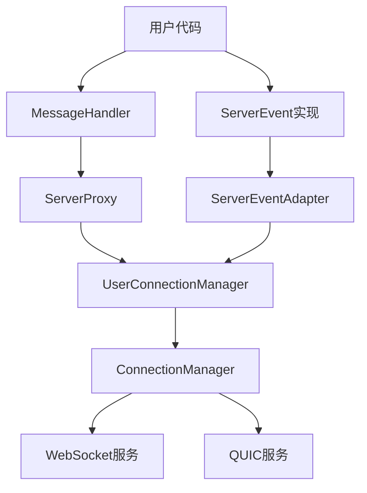

# 简化版事件处理机制设计文档

## 概述

为了满足快速开始和简化使用的需求，我们在原有的复杂事件处理机制基础上，提供了一套简化的事件处理接口。用户可以根据自己的需求选择使用完整版或简化版的事件处理机制。

## 设计理念

1. **向后兼容**：保持原有的 [ServerEvent](file:///Users/hg/workspace/rust/flare-core/src/server/event.rs#L36-L56) 接口不变，确保现有代码无需修改
2. **简化使用**：提供 [BasicServerEvent](file:///Users/hg/workspace/rust/flare-core/src/server/event.rs#L24-L40) 接口，只包含最核心的事件处理方法
3. **灵活适配**：通过 [ServerEventAdapter](file:///Users/hg/workspace/rust/flare-core/src/server/adapter/server_event_adapter.rs#L11-L15) 适配不同的事件处理接口

## 核心接口

### 1. BasicServerEvent（简化版）

```rust
/// 基础服务端事件处理器
///
/// 为快速开始的 proxy 提供最简化的事件处理接口
#[async_trait::async_trait]
pub trait BasicServerEvent: Send + Sync {
    /// 用户认证请求
    async fn on_authentication_request(&self, connection_id: &str, user_id: &str, platform: &str, token: &str) {
        // 默认实现为空
    }
    
    /// 用户消息
    async fn on_user_message(&self, connection_id: &str, user_id: &str, message: &Frame) -> Result<()> {
        // 默认实现返回Ok
        Ok(())
    }
}
```

### 2. ServerEvent（完整版）

```rust
/// 服务端连接事件处理器
/// 
/// 扩展基础连接事件，提供服务端特有的事件回调
#[async_trait::async_trait]
pub trait ServerEvent: ConnectionEvent + Send + Sync {
    /// 用户认证请求
    async fn on_authentication_request(&self, connection_id: &str, user_id: &str, platform: &str, token: &str);
    
    /// 用户认证响应
    async fn on_authentication_response(&self, connection_id: &str, success: bool, user_info: Option<Vec<u8>>, error_message: Option<String>);
    
    /// 用户消息
    async fn on_user_message(&self, connection_id: &str, user_id: &str, message: &Frame) -> Result<()>;
    
    // ... 其他连接事件方法
}
```

### 3. MessageHandler（用于快速开始的处理器规范）

```rust
/// 用户消息处理器
///
/// 用户需要实现此接口来处理业务消息
/// 这是简化版的事件处理接口，适用于快速开始的场景
#[async_trait]
pub trait MessageHandler: Send + Sync {
    /// 处理用户消息
    async fn handle_user_message(&self, user_id: &str, connection_id: &str, message: &Frame) -> Result<()>;
    
    /// 处理认证请求
    async fn handle_authentication_request(&self, connection_id: &str, user_id: &str, platform: &str, token: &str) -> Result<()>;
    
    /// 处理连接事件
    async fn handle_connection_event(&self, event: ConnectionEventType, connection_id: &str, details: Option<&str>) -> Result<()>;
    
    /// 处理心跳事件
    async fn handle_heartbeat(&self, connection_id: &str, is_ping: bool) -> Result<()> {
        // 默认实现为空
        Ok(())
    }
}
```

## 架构图



## 使用场景

### 1. 快速开始（使用简化版）

对于只需要基本功能的用户，可以实现 [MessageHandler](file:///Users/hg/workspace/rust/flare-core/src/server/proxy/message_handler.rs#L18-L66) 接口：

```rust
struct MyMessageHandler;

#[async_trait]
impl MessageHandler for MyMessageHandler {
    async fn handle_user_message(&self, user_id: &str, connection_id: &str, message: &Frame) -> Result<()> {
        // 处理用户消息
        Ok(())
    }
    
    async fn handle_authentication_request(&self, connection_id: &str, user_id: &str, platform: &str, token: &str) -> Result<()> {
        // 处理认证请求
        Ok(())
    }
    
    async fn handle_connection_event(&self, event: ConnectionEventType, connection_id: &str, details: Option<&str>) -> Result<()> {
        // 处理连接事件
        Ok(())
    }
}

// 使用简化版
let message_handler = Arc::new(MyMessageHandler);
let server_proxy = ServerProxy::new(Some(message_handler));
```

### 2. 高级定制（使用完整版）

对于需要更多控制的用户，可以实现 [ServerEvent](file:///Users/hg/workspace/rust/flare-core/src/server/event.rs#L36-L56) 接口：

```rust
struct MyServerEventHandler;

#[async_trait]
impl ServerEvent for MyServerEventHandler {
    async fn on_authentication_request(&self, connection_id: &str, user_id: &str, platform: &str, token: &str) {
        // 处理认证请求
    }
    
    async fn on_authentication_response(&self, connection_id: &str, success: bool, user_info: Option<Vec<u8>>, error_message: Option<String>) {
        // 处理认证响应
    }
    
    async fn on_user_message(&self, connection_id: &str, user_id: &str, message: &Frame) -> Result<()> {
        // 处理用户消息
        Ok(())
    }
    
    // ... 实现其他事件方法
}
```

## 优势

1. **降低入门门槛**：简化版接口只包含最核心的功能，用户可以快速上手
2. **保持灵活性**：完整版接口保留了所有功能，满足高级用户的需求
3. **代码复用**：通过适配器模式，两种接口可以共用同一套基础设施
4. **渐进式学习**：用户可以从简化版开始，逐步了解和使用完整功能

## 示例代码

完整的使用示例请参考 [simple_example.rs](file:///Users/hg/workspace/rust/flare-core/src/server/doc/simple_example.rs)

## 总结

通过提供简化版和完整版两套事件处理接口，我们既满足了快速开始用户的需求，又保持了对高级功能的支持。这种设计使得我们的框架更加灵活和易用。