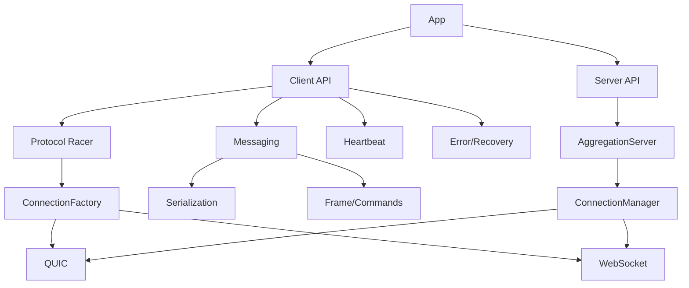

# Flare-Core 即时通讯(IM)核心长连接库技术设计文档

版本：v1.0
作者：Flare Team
日期：2025-10-11

## 1. 概述
Flare-Core 是一个支持 QUIC 和 WebSocket 的高性能、可靠的即时通讯长连接库，面向 IM、实时协作、游戏、推送等场景。它提供统一的客户端与服务端抽象、协议竞速机制、可靠消息收发、心跳保活、错误处理与连接恢复、认证与安全（TLS/mTLS）、以及易于扩展的模块化架构。

目标：
- 统一抽象下支持多传输协议（当前：QUIC/WebSocket）
- 面向 IM 的可靠消息机制（序列化、确认、重传）
- 协议竞速与动态切换，提升连接成功率与质量
- 内置心跳与质量监控，支持超时检测与处理
- 健壮错误处理与自动重连能力
- 简洁 API 便于上层集成
- 可扩展架构，便于新增协议与功能

## 2. 整体架构设计
架构采用分层与模块化思想：
- 连接层（Transport Layer）：QUIC/WebSocket 实现，负责底层收发与会话维护
- 协议抽象层（Connection Abstraction）：统一连接接口、事件、统计、配置
- 消息层（Messaging Layer）：Frame/Command、序列化器、消息确认与重传策略
- 客户端层（Client Layer）：协议竞速、心跳、错误处理、重连、API 封装
- 服务端层（Server Layer）：聚合服务、连接管理、事件转发、认证与安全

关键模块与入口：
- 客户端主入口：[src/client/client.rs]
- 协议竞速器：[src/client/protocol_racing.rs]
- 连接抽象与实现：
  - 抽象与工厂：[src/common/connections/factory.rs], [src/common/connections/config.rs], [src/common/connections/types.rs]
  - QUIC：[src/common/connections/quic.rs]
  - WebSocket：[src/common/connections/websocket.rs]
- 消息序列化与命令：[src/common/protocol/*], [src/common/serialization/*]
- 服务端聚合：[src/server/server.rs], QUIC 服务端：[src/server/quic.rs], WebSocket 服务端：[src/server/websocket.rs]
- FastClient/FastServer 提供更高层的封装（认证、事件、消息派发等）：[src/client/fast/*], [src/server/fast/*]

（示意）


## 3. 核心模块说明
### 3.1 连接抽象与工厂（ConnectionFactory）
- 统一创建客户端/服务端连接，屏蔽传输细节
- 提供创建 QUIC/WebSocket 端点、连接对象的方法
- 实现 TLS/mTLS 配置加载与应用（仅客户端证书在需要时启用）

关键接口：
- `ConnectionFactory::create_client(config)`：按 `Transport` 创建客户端连接。
- `ConnectionFactory::create_client_with_handler(config, handler)`：同上，附加事件处理器。
- `ConnectionFactory::create_quic_client_config(config)`：按客户端 `QuicClientConfig` 构建 `quinn::ClientConfig`。
- `ConnectionFactory::create_quic_server_endpoint(config)`：按服务端 `QuicServerConfig` 构建 `quinn::Endpoint`。

### 3.2 连接类型实现（QUIC/WebSocket）
- QUIC（[src/common/connections/quic.rs]）：
  - 底层连接的流读写；消息发送通道；接收任务；心跳任务
  - 超时保护：`open_bi()` 打开双向流时增加超时
  - 状态机与事件回调：on_connected/on_disconnected/on_error/质量变化/统计更新
- WebSocket（[src/common/connections/websocket.rs]）：
  - 使用 tokio-tungstenite 实现握手、消息收发
  - 同步心跳与事件模型

### 3.3 消息层（Frame/Commands/Serialization）
- Frame（消息帧）：携带 `Command` 与消息 ID；支持 `Reliability`（AtLeastOnce/BestEffort 等）
- Commands：
  - ControlCmd（Ping/Pong 等）
  - MessageCmd（Send/Data 等）
  - NotificationCmd/EventCmd（扩展用）
- 序列化：支持 JSON/Protobuf/MessagePack/CBOR，序列化工厂选择；上层可配置 `SerializationFormat`
- 确认与重传：
  - AtLeastOnce：发送端保留待确认队列，超时触发重传（由 Messaging 模块实现，结合 `MessageHandler`与 `FrameSerializer`）
  - BestEffort：无需确认

### 3.4 客户端层（Client）
- 协议选择：
  - QuicOnly/WebSocketOnly/Auto（协议竞速）
  - 竞速流程：并行发起 QUIC/WebSocket 连接，先成功的获胜；失败/超时有详细日志与统计
- 心跳：
  - 定时发送心跳帧（Ping/Pong）；超时触发质量下降与事件回调
- 错误与恢复：
  - 连接错误回调；可选自动重连任务（可按策略启用/配置）
- API：
  - `connect()/disconnect()/reconnect()`
  - `send_request()`（等待响应消息）
  - `send_fire_and_forget()`（无需响应）
  - 获取状态/统计/当前协议等

### 3.5 服务端层（AggregationServer/QuicServer/WebSocketServer）
- 按 ServerConfig 启动单协议或双协议模式
- 连接管理器：连接统计/心跳清理/周期任务
- 事件适配器：统一派发连接事件到上层
- TLS/mTLS：
  - 服务端证书与私钥（server.crt/server.key）
  - 客户端证书校验可配置（require_client_auth），仅必要时启用；默认关闭以避免私钥分发风险

### 3.6 Fast 封装（FastClient/FastServer）
- 提供更完善的认证流程与事件体系
- 内置消息派发与扩展点（MessageHandler/FastEvent）
- 示例支持聊天广播、协议竞速等功能

## 4. 接口定义与配置
### 4.1 客户端 API（简要）
- `Client::connect() -> Result<()>`
- `Client::disconnect() -> Result<()>`
- `Client::reconnect() -> Result<()>`
- `Client::send_request<F>(create_command: F, reliability, timeout) -> Result<Frame>`
- `Client::send_fire_and_forget<F>(create_command: F, reliability) -> Result<()>`
- `ClientEvent`：`on_connected/on_disconnected/on_error/on_quality_changed/...`
- 配置：`ClientConfig`（协议、心跳、序列化等）

### 4.2 连接接口（简要）
- `ClientConnection`/`ServerConnection`：`connect/accept/send_message/disconnect/set_event_handler/stats/state` 等
- `ConnectionEvent`：连接事件回调集合
- `ConnectionConfig`：统一连接配置，嵌套 `ProtocolConfig` 与 Quic/WebSocket 子配置

### 4.3 服务端 API（简要）
- `ServerBuilder::new(config).with_event_handler(handler).build()`
- `AggregationsServer::start()/stop()`
- `ServerConfig`：`server_type`、协议子配置、心跳与性能、安全配置等；`default_dual_protocol()` 提供双协议样板

## 5. 序列化方案选择
- 支持 JSON/Protobuf/MessagePack/CBOR，多序列化格式由 `SerializationConfig` 指定
- IM场景建议 Protobuf：
  - 二进制结构化、字段演进友好
  - 较低开销与较好跨语言支持
- 可扩展：序列化工厂可注入自定义序列化器

## 6. 协议竞速机制
- 目标：提升连接成功率与质量，降低首连时延
- 实现：
  - `ProtocolRacer::race(base_config, server_addresses, [Quic,WebSocket])`
  - 并行发起连接，先成功者获胜；失败记录详细日志
  - 竞速超时可配置；支持统计与回调
- 切换策略（后续计划）：在运行时监控质量，必要时触发协议切换

## 7. 心跳保活策略
- 客户端与服务端均内置心跳任务；间隔与超时可配置
- 心跳超时：
  - 触发质量评分下降、事件通知（如 `on_heartbeat_timeout`）
  - 连续超时达阈值可触发重连或断开
- 质量评分：基于活跃度计算，定期事件回调 `on_quality_changed`

## 8. 错误处理与连接恢复
- 明确错误类型与上下文日志（含 LocalizedError）
- 发送任务的稳健性：单条消息失败不导致任务整体崩溃
- 自动重连（可选）：
  - 定时检测状态；尝试按策略重连；事件反馈（开始/成功/失败）
- 竞速失败的处理：统计失败原因与个数，便于定位

## 9. 可靠消息（确认与重传）
- AtLeastOnce：
  - 消息附带 ID；发送端保留待确认表；超时重传
  - 收到重复 ID 可幂等处理（由上层业务或 MessageHandler 定义）
- BestEffort：
  - 单次发送，不保证达达
- 可靠性与性能权衡：由 `Reliability` 指定，消息级可选

## 10. 安全与认证（TLS/mTLS）
- 服务端：默认启用 TLS，加载 server.crt/server.key
- 客户端：默认仅验证服务端证书（server.crt + SNI）；可选跳过仅用于开发测试
- mTLS 控制：
  - 服务端 `require_client_auth` 决定是否要求客户端证书；默认关闭
  - 客户端 `client_cert_path/client_key_path` 在必要时启用
- 证书管理建议：
  - 严禁分发服务端私钥到客户端；客户端仅持有服务端公钥证书或 CA 根证书

## 11. 易用 API 与示例
- 客户端示例：[examples/client/fast_client_example.rs], [examples/client/quic_client.rs]
- 服务端示例：[examples/server/fast_server_example.rs], [examples/server/quic_server.rs]
- 聊天示例：
  - 客户端输入用户名与消息，`MessageCmd::Data(JSON)` 发送
  - 服务端 `MessageHandler.handle_data_message` 广播

## 12. 可扩展性设计
- 新增协议：
  - 实现 `ClientConnection/ServerConnection` 接口与 `ConnectionFactory` 支持
  - 在 `ProtocolRacer` 注册新协议以参与竞速
- 新增序列化：
  - 扩展 `SerializerFactory` 并注册格式
- 新增可靠策略：
  - 在 Messaging 层扩展确认与重传策略

## 13. 配置与参数
- 客户端：`ClientConfig`（心跳、协议选择、序列化、重连等）
- 服务端：`ServerConfig`（ServerType、双协议、TLS、心跳、安全与性能）
- 连接：`ConnectionConfig`（传输、心跳、缓冲、协议子配置、序列化）

## 14. 与 flare-core 的对齐
- 遵循 flare-core 的模块组织与命名规范
- 使用 `tracing` 进行结构化日志
- 事件/接口实现与当前代码一致；新增文档仅阐述既有实现与扩展路线

## 15. 后续规划
- 运行时协议切换（降级/升级）
- 更完善的可靠性（Exactly-Once 结合幂等键与服务端状态）
- 流控与背压机制
- 更丰富的认证与授权（OIDC、JWT 等）

## 16. 参考
- QUIC/QUINN：https://github.com/quinn-rs/quinn
- Rustls：https://github.com/rustls/rustls
- tokio-tungstenite：https://github.com/snapview/tokio-tungstenite

## 17. 连接层架构细化与实现规范

### 17.1 连接抽象与统一创建机制
- 统一接口定义（对齐现有实现）：
  - 客户端连接 `ClientConnection`：
    - 生命周期方法：`connect() -> Result<()>`、`disconnect(reason: Option<String>) -> Result<()>`
    - 消息发送：`send_message(frame: Frame) -> Result<()>`
    - 事件注册：`set_event_handler(handler: Arc<dyn ConnectionEvent>)`
    - 状态查询：`state() -> ConnectionState`、`status() -> ConnectionState`
    - 统计信息：`stats() -> ConnectionStats`、`last_activity_epoch_ms()`
    - 标识：`id() -> String`
  - 服务端连接 `ServerConnection`：
    - 生命周期方法：`accept() -> Result<()>`（完成握手与任务启动）、`close(reason: Option<String>) -> Result<()>`
    - 其余接口与客户端一致（发送、事件注册、状态/统计）
  - 事件接口 `ConnectionEvent`：
    - `on_connected/on_disconnected/on_error/on_message_received/on_message_sent/on_heartbeat_timeout/on_quality_changed/on_statistics_updated/on_heartbeat_ping/on_heartbeat_pong/on_reconnect_started/on_reconnected/on_reconnect_failed`
- 统一创建机制（`ConnectionFactory`）：
  - 入口：
    - `create_client(config: ConnectionConfig) -> Result<Box<dyn ClientConnection>>`
    - `create_client_with_handler(config, handler) -> Result<Box<dyn ClientConnection>>`
    - 服务端：`from_quic/with_handler_arc`、`from_websocket/with_handler_arc` 用于从原始连接构建服务端连接
  - 根据 `config.transport` 分发：
    - QUIC → `QuicConnection::new(config)` 或 `with_serializer`
    - WebSocket → `WebSocketConnection::new(config)` 或 `with_serializer`
  - TLS/mTLS：
    - 客户端侧：`create_quic_client_config(config)` 按 `QuicClientConfig` 加载 `server_cert_path/server_hostname`，必要时加载 `client_cert_path/client_key_path`；支持跳过验证仅限开发测试
    - 服务端侧：`create_quic_server_endpoint(config)` 与 `create_quic_server_config(config)` 按 `QuicServerConfig` 加载 `cert_path/key_path`；当 `require_client_auth` 为真时加载 CA 并启用 `WebPkiClientVerifier`，否则 `with_no_client_auth()`
- 连接配置（`ConnectionConfig`）结构化说明：
  - 通用字段：`id/role/transport/remote_addr/local_addr/timeout_ms/heartbeat_interval_ms/heartbeat_timeout_ms/max_missed_heartbeats/buffer_size/max_message_size/serialization_config`
  - 客户端特有：`client_config`（`enable_tls/auto_reconnect/max_reconnect_attempts/reconnect_delay_ms/user_id/platform/token`）
  - 服务端特有：`server_config`（`auto_heartbeat_response/heartbeat_monitor_timeout_ms/cleanup_interval_ms`）
  - 协议子配置：`protocol_config` 包含：
    - `WebSocketConfig`（`subprotocols/extensions/compression_threshold`）
    - `QuicConfig`（`client: QuicClientConfig` 与 `server: QuicServerConfig`）
      - `QuicClientConfig`：`max_concurrent_streams/initial_stream_window/connection_window/congestion_control/server_cert_path/skip_server_verification/server_hostname/client_cert_path/client_key_path`
      - `QuicServerConfig`：`max_concurrent_streams/initial_stream_window/connection_window/congestion_control/cert_path/key_path/server_hostname/require_client_auth/client_ca_cert_path`

### 17.2 连接管理器职责（服务端）
- 目标：集中管理服务端所有连接，提供健康维护、统计与事件协作。
- 职责：
  - 连接增删查改：`add_connection(connection_arc)`、`remove_connection(id)`、`get_connection(id)`
  - 状态监控：周期遍历连接状态与心跳，检测超时与异常，触发清理与事件
  - 心跳维护：结合连接自身心跳任务的统计，统一汇总与告警
  - 超时清理：按 `server_config.cleanup_interval_ms` 定期执行；关闭长时间无活动或已失败的连接
  - 统计聚合：`get_connection_stats()` 返回总连接数、活跃连接数、总消息数、平均质量等
- 数据结构建议：
  - 使用 `DashMap<String, Arc<dyn ServerConnection>>` 以连接ID索引，线程安全且高并发
  - 可选维度：`user_id -> Vec<connection_id>`，便于同用户多连接管理
- 与上层事件系统交互：
  - 通过 `ServerEventAdapter` 转发连接事件到上层（如 on_connected/on_disconnected）
  - 统计与告警事件周期上报（日志或指标系统）

### 17.3 协议统一管理与扩展性
- QUIC vs WebSocket 异同：
  - 握手：QUIC（TLS 内建握手），WebSocket（HTTP 握手 + 可选 TLS）；统一为 `connect/accept` 接口
  - 流控制：QUIC 双向/单向流；WebSocket 消息帧；统一为 `send_message(frame)`，内部处理流/帧差异
  - 错误码：统一映射到 `FlareError`（如 `connection_failed/serialization_error/message_send_failed`），保留原始错误文本
- 扩展点（新增协议，如 HTTP/3 或自定义）：
  - 实现 `ClientConnection/ServerConnection` 接口（生命周期、发送、事件、状态/统计）
  - 在 `ConnectionFactory::create_by_transport` 注册新 `Transport` 的构建逻辑
  - 在 `ConnectionConfig::protocol_config` 增加对应子配置
  - 在 `ProtocolRacer` 中纳入新协议参赛，提供地址映射与优先策略
- 协议竞速协作：
  - `ProtocolRacer::race(base_config, server_addresses, protocols)` 并行调用工厂创建与连接；最先成功者返回
  - 失败统计记录并回传；胜者协议记入 `Client.current_protocol`

### 17.4 连接全生命周期控制
- 状态机（`ConnectionState` 对齐现有实现）：
  - `Initializing` → `Connecting` → `Connected` → (`Ready` 可选，认证完成) → `Disconnecting` → `Disconnected`；异常进入 `Failed`；断线重试进入 `Reconnecting`
- 状态转换条件：
  - `Initializing`：构造完成，配置加载
  - `Connecting`：发起握手；成功进入 `Connected`，失败进入 `Failed`
  - `Ready`：认证完成或链路准备完毕
  - `Disconnecting/Disconnected`：主动或被动关闭后资源清理完成
  - `Failed/Reconnecting`：错误或心跳超时后按策略尝试重连，成功回到 `Connected`
- 心跳任务：
  - 定时（`heartbeat_interval_ms`）发送心跳帧（Ping），收到 `Pong` 更新活跃时间与质量分
  - 超时（`heartbeat_timeout_ms`）触发 `on_heartbeat_timeout` 与质量下降；连续超时超过阈值（如 3 次）进入降级或重连流程
  - 质量评分：基于最近活动时间与超时情况计算，变化显著时回调 `on_quality_changed`
- 异常断开处理：
  - 立即停止接收/发送/心跳任务；释放流与连接；记录错误并回调 `on_error`
  - 资源回收：关闭底层连接（`conn.close(...)`）、清理任务句柄与发送队列
  - 重连尝试：按 `ClientSpecificConfig max_reconnect_attempts/reconnect_delay_ms` 执行指数退避或固定间隔重试；失败回调 `on_reconnect_failed`

### 17.5 客户端与服务端基础包职责划分
- 客户端（`src/client/*`）：
  - 协议选择：`ClientConfig.protocol_selection`（QuicOnly/WebSocketOnly/Auto）
  - 连接建立：通过 `ConnectionFactory` 与 `ProtocolRacer` 获取最佳连接
  - 消息发送：统一 `send_request/send_fire_and_forget`，可靠性由 `Reliability` 指定
  - 错误恢复：错误回调与可选自动重连任务；状态与统计查询、质量评分
  - 心跳维持：自动心跳任务与超时检测
- 服务端（`src/server/*`）：
  - 监听端口：WebSocket/QUIC 服务按 `ServerConfig` 启动（单协议或双协议）
  - 接受连接：`QuicServer/WebSocketServer` 在 `accept()` 后创建服务端连接
  - 连接管理：`ConnectionManager` 周期性清理、统计与事件协作
  - 事件分发：`ServerEventAdapter` 将底层事件转发到上层业务
  - 安全认证：TLS 默认启用；mTLS 可按需通过 `require_client_auth` 开启（默认关闭）

（以上细化内容已与当前 flare-core 的模块结构与命名保持一致，接口与职责对齐现有实现，便于后续扩展与维护。）

## 18. 连接层实现规范（深入细化）

本节在第 17 节基础上，进一步以“可实施”的粒度明确接口、配置、管理与生命周期策略，确保代码实现与文档一一对应。

### 18.1 连接抽象与统一创建机制（可实施接口）
- 接口签名建议（对齐现有模块命名，示例为 trait 形态）：
  - `ClientConnection`
    - `connect() -> Result<()>`
    - `disconnect(reason: Option<String>) -> Result<()>`
    - `send_message(frame: Frame) -> Result<()>`
    - `set_event_handler(handler: Arc<dyn ConnectionEvent>)`
    - `state() -> ConnectionState`
    - `stats() -> ConnectionStats`
    - `last_activity_epoch_ms() -> u64`
    - `id() -> String`
  - `ServerConnection`
    - `accept() -> Result<()>`（完成握手并启动接收/心跳任务）
    - `close(reason: Option<String>) -> Result<()>`
    - 发送/事件/状态/统计与 `ClientConnection` 对齐（统一接口便于上层编程）
  - `ConnectionEvent`
    - 连接类：`on_connected()`, `on_disconnected(reason: Option<String>)`, `on_error(err: FlareError)`
    - 消息类：`on_message_received(frame: Frame)`, `on_message_sent(frame: Frame)`
    - 心跳与质量：`on_heartbeat_ping()`, `on_heartbeat_pong(rtt_ms: u32)`, `on_heartbeat_timeout()`, `on_quality_changed(quality: u8)`
    - 统计与恢复：`on_statistics_updated(stats: ConnectionStats)`, `on_reconnect_started()`, `on_reconnected()`, `on_reconnect_failed(err: FlareError)`
- 统一创建机制（`ConnectionFactory`）实现要点：
  - 客户端创建入口：
    - `create_client(config: ConnectionConfig) -> Result<Box<dyn ClientConnection>>`
    - `create_client_with_handler(config: ConnectionConfig, handler: Arc<dyn ConnectionEvent>) -> Result<Box<dyn ClientConnection>>`
  - 服务端包装入口（将底层原生连接封装为统一接口）：
    - `from_quic(conn: quinn::Connection, config: ConnectionConfig) -> Arc<dyn ServerConnection>`
    - `from_websocket(stream: tokio_tungstenite::WebSocketStream<...>, config: ConnectionConfig) -> Arc<dyn ServerConnection>`
  - 分发逻辑：`match config.transport { Transport::Quic => QuicConnection::new(config), Transport::WebSocket => WebSocketConnection::new(config) }`
  - TLS/mTLS 构建：
    - 客户端 QUIC：`create_quic_client_config(quic_client_cfg: QuicClientConfig)`
      - 加载 `server_cert_path` 与 `server_hostname`（SNI），默认启用服务端证书验证
      - 当提供 `client_cert_path/client_key_path` 时启用双向 TLS；否则 `with_no_client_auth()`
      - 支持开发开关 `skip_server_verification`（仅用于测试）
    - 服务端 QUIC：`create_quic_server_config(quic_server_cfg: QuicServerConfig)` + `create_quic_server_endpoint(...)`
      - 加载 `cert_path/key_path` 构建 `rustls::ServerConfig`
      - 当 `require_client_auth == true` 时：加载 `client_ca_cert_path` 到 `RootCertStore`，使用 `WebPkiClientVerifier::builder(Arc<RootCertStore>)`
      - 否则 `with_no_client_auth()`，仅服务端证书
- `ConnectionConfig` 结构化约束与示例字段（与现有定义一致并补充说明）：
  - 通用：`id`, `role`, `transport`, `remote_addr`, `local_addr`, `timeout_ms`, `heartbeat_interval_ms`, `heartbeat_timeout_ms`, `max_missed_heartbeats`, `buffer_size`, `max_message_size`, `serialization_config`
  - 客户端特有：`enable_tls`, `auto_reconnect`, `max_reconnect_attempts`, `reconnect_delay_ms`, `user_id`, `platform`, `token`
  - 服务端特有：`auto_heartbeat_response`, `heartbeat_monitor_timeout_ms`, `cleanup_interval_ms`
  - 协议子配置（`protocol_config`）：
    - `WebSocketConfig`：`subprotocols`, `extensions`, `compression_threshold`
    - `QuicConfig`：包含 `client: QuicClientConfig` 与 `server: QuicServerConfig`
      - `QuicClientConfig`：`max_concurrent_streams`, `initial_stream_window`, `connection_window`, `congestion_control`, `server_cert_path`, `skip_server_verification`, `server_hostname`, `client_cert_path`, `client_key_path`
      - `QuicServerConfig`：`max_concurrent_streams`, `initial_stream_window`, `connection_window`, `congestion_control`, `cert_path`, `key_path`, `server_hostname`, `require_client_auth`, `client_ca_cert_path`

### 18.2 连接管理器职责（服务端可运行策略）
- 管理接口（对齐 `ConnectionManager` 设计）：
  - `add_connection(conn: Arc<dyn ServerConnection>) -> bool`（按 `conn.id()` 插入，返回是否新增）
  - `remove_connection(id: &str) -> Option<Arc<dyn ServerConnection>>`
  - `get_connection(id: &str) -> Option<Arc<dyn ServerConnection>>`
  - `connections_by_user(user_id: &str) -> Vec<String>`（可选维度索引）
  - `stats_snapshot() -> AggregatedStats`（聚合统计）
- 数据结构：
  - 主索引：`DashMap<String, Arc<dyn ServerConnection>>`
  - 附加索引：`DashMap<String, Vec<String>>`（`user_id -> [conn_id]`）
- 心跳与清理调度：
  - 周期任务间隔：`cleanup_interval_ms`（如 5s/10s 可配置）
  - 清理算法：
    1. 遍历所有连接，读取 `last_activity_epoch_ms()` 与 `state()`
    2. 若 `state == Failed/Disconnected` 或超过 `heartbeat_monitor_timeout_ms` 无活动，则执行 `close(...)` 并 `remove_connection(id)`
    3. 对 `max_missed_heartbeats` 超阈的连接标记降级或触发上报事件
  - 统计聚合：
    - 计数：`total`, `active`, `failed`, `reconnecting`
    - 速率：`msg_send_rate`, `msg_recv_rate`
    - 质量：`avg_quality`（0-100）
- 与事件系统协同：
  - 通过 `ServerEventAdapter` 转发 `on_connected/on_disconnected/on_error` 到上层
  - 周期上报 `stats_snapshot()`（日志/metrics），供监控与告警

### 18.3 协议统一管理与扩展性（注册与映射）
- 差异封装原则：
  - 握手抽象到 `connect/accept`；流/帧差异统一到 `send_message(frame)`；错误统一到 `FlareError`（同时保留 `source`）
- 新增协议注册流程：
  1. 定义新 `Transport` 枚举值（如 `Http3`/`CustomX`）
  2. 实现 `ClientConnection/ServerConnection`，并在 `ConnectionFactory` 的分发处增加构建分支
  3. 为 `ConnectionConfig.protocol_config` 增加对应子配置结构体
  4. 在 `ProtocolRacer` 中加入该协议，提供地址/优先级/超时策略
- 错误码映射建议：
  - 连接失败：`FlareError::connection_failed(context)`（含底层错误）
  - 序列化失败：`FlareError::serialization_error(format, detail)`
  - 发送失败：`FlareError::message_send_failed(reason)`
  - 心跳超时：`FlareError::heartbeat_timeout(missed)`
  - 认证失败：`FlareError::authentication_failed(detail)`

### 18.4 连接全生命周期控制（状态机与心跳算法）
- 状态机（与现有 `ConnectionState` 对齐）：
``mermaid
graph TB
    A[Initializing] --> B[Connecting]
    B --> C[Connected]
    C --> D[Ready]
    C --> E[Disconnecting]
    D --> E[Disconnecting]
    E --> F[Disconnected]
    B --> G[Failed]
    C --> H[Reconnecting]
    H --> C
    H --> G
```
- 转换策略要点：
  - `Connecting→Connected`：握手成功；失败进入 `Failed`
  - `Connected→Ready`：认证或链路准备完成（如 mTLS 客户端校验通过）
  - `Ready/Connected→Disconnecting→Disconnected`：主动或被动关闭完成资源回收
  - `Connected/Ready→Reconnecting`：达到连续心跳超时阈值或链路异常时触发重连
- 心跳算法：
  - 发送：每 `heartbeat_interval_ms` 向对端发送 `Ping`，附带时间戳
  - 接收：收到 `Pong` 计算 RTT 与更新 `last_activity_epoch_ms`、`quality`
  - 超时：超过 `heartbeat_timeout_ms` 未收到 `Pong` 计一次 Miss；累计 `max_missed_heartbeats` 触发降级或重连
  - 质量评分：基于最近 RTT 与 Miss 次数，建议区间 0-100；变化显著触发 `on_quality_changed`
- 异常与重连：
  - 异常断开立即 `on_error` 并停用任务；执行指数退避或固定间隔重试（由 `reconnect_delay_ms` 与 `max_reconnect_attempts` 控制）

### 18.5 客户端与服务端基础包职责划分（目录与职责）
- 客户端（`src/client/*`）：
  - 协议选择：`ProtocolSelection::QuicOnly/WebSocketOnly/Auto`
  - 连接建立：`ConnectionFactory` + `ProtocolRacer` 获取最佳连接
  - 消息发送：`send_request` / `send_fire_and_forget`（携带 `Reliability`）
  - 错误恢复：自动重连（可配），事件通知与状态/统计查询
  - 心跳维持：定时心跳与超时检测、质量评分更新
- 服务端（`src/server/*`）：
  - 监听与接受：`QuicServer` / `WebSocketServer` 监听并在 `accept()` 后创建 `ServerConnection`
  - 连接管理：`ConnectionManager` 增删查改、心跳与清理调度、统计聚合
  - 事件分发：`ServerEventAdapter` 统一转发到底层/上层业务
  - 安全认证：TLS 默认启用；mTLS 通过 `require_client_auth` 控制

以上条款均与当前 flare-core 模块结构与命名规范保持一致，可直接用于指导实现与代码评审。

## 19. 模块职责划分与目录结构（重构优化）

本节对项目模块进行明确的职责划分与目录结构优化，确保 common 模块仅包含通用组件，客户端/服务端各自封装专属功能；连接层严格保持通用性作为基础能力在 common 中实现。

### 19.1 模块划分原则
- 单一职责：common 仅承载通用抽象与基础实现，不包含任何客户端或服务端特有的业务逻辑。
- 明确边界：客户端/服务端各自封装其专属功能，避免交叉依赖；通过 trait 接口与事件回调进行交互。
- 向下依赖：client/server 依赖 common；common 不依赖 client/server。
- 可扩展：保持协议、序列化、连接工厂的可扩展性，便于新增协议与功能。

### 19.2 目录结构（建议）

src/
- common/
  - connections/
    - enums.rs            // 通用枚举（Transport、ConnectionState 等）
    - traits.rs           // 连接抽象 trait：`ClientConnection`、`ServerConnection`、`ConnectionEvent`
    - types.rs            // 通用统计结构：`ConnectionStats`
    - config.rs           // 连接通用配置：`ConnectionConfig`，含协议子配置
    - factory.rs          // 连接工厂：创建 client/server 连接与 TLS/mTLS 配置构建
    - monitor.rs          // 心跳/质量评分辅助算法（通用）
    - quic.rs             // QUIC 连接最小实现（客户端/服务端通用骨架）
    - websocket.rs        // WebSocket 连接最小实现（客户端/服务端通用骨架）
    - mod.rs              // 模块导出
  - protocol/
    - reliability.rs      // `Reliability`（AtLeastOnce/BestEffort）
    - frame.rs            // `Frame` 定义（携带 `Command`、`message_id`、`payload`、`reliability`）
    - commands.rs         // `Command`：`ControlCmd(Ping/Pong)`、`MessageCmd(Data/Ack/Custom)` 等
    - factory.rs          // `FrameFactory`：`generate_message_id/create_ping/create_pong/create_data`
    - mod.rs              // 模块导出
  - serialization/
    - traits.rs           // `Serializer` trait（对象安全最小接口）
    - mod.rs              // `SerializationFormat/SerializationConfig`
    - factory.rs          // `SerializerFactory` 返回枚举 `AnySerializer`
    - json.rs             // JSON 实现（最小）
    - protobuf.rs         // Protobuf 实现（占位）
  - error.rs              // `FlareError` 定义与分类
- client/
  - mod.rs                // 客户端主入口与导出
  - config.rs             // `ClientConfig`、协议选择 `ProtocolSelection`
  - protocol_racing.rs    // 协议竞速（Auto 模式并行连接，择优）
  - reconnect.rs          // 自动重连策略与任务（指数退避/固定间隔）
  - auth.rs               // 客户端认证封装（Token/平台/用户ID等）
  - fast/
    - fast_client.rs      // 高层封装（认证、事件、消息派发）
    - event.rs            // Fast 客户端事件扩展
- server/
  - mod.rs                // 服务端主入口与导出
  - config.rs             // `ServerConfig`（双协议、心跳、安全与性能）
  - manager/
    - connection_manager.rs // 连接管理器（增删查改、心跳清理、统计聚合）
  - adapter/
    - server_event_adapter.rs // 事件适配器（连接事件 → 上层业务）
  - quic.rs               // QUIC 服务端监听与接受连接
  - websocket.rs          // WebSocket 服务端监听与接受连接
  - fast/
    - fast_server.rs      // 高层封装（事件体系、消息派发）
    - event.rs            // Fast 服务端事件扩展

### 19.3 职责详细描述
- common 模块（共享通用组件）：
  - 连接抽象与工厂：`ClientConnection/ServerConnection/ConnectionEvent`、`ConnectionFactory`、`ConnectionConfig`
  - 协议帧与命令：`Frame`、`Command`、`Reliability`、`FrameFactory`
  - 序列化基础：`Serializer` trait、`SerializationFormat/SerializationConfig`、`SerializerFactory`
  - 心跳与质量：`monitor`（评分与超时判定），连接对象内的心跳骨架与事件触发（不包含“自动重连”等客户端特有逻辑）
  - TLS/mTLS：加载与校验的通用构建（客户端/服务端各自配置，但放置于工厂以复用）
- client 模块（客户端专有逻辑）：
  - 协议竞速：`ProtocolSelection::Auto`、`ProtocolRacer`（并行发起连接、择优）
  - 自动重连：按策略启动/停止重连任务，处理 `on_reconnect_*` 事件
  - 客户端认证：封装 Token/平台/用户ID，参与 `Ready` 状态判定与上层授权
  - 高层 API：`send_request/send_fire_and_forget/reconnect` 与状态/统计查询
- server 模块（服务端专有逻辑）：
  - 多协议监听：按 `ServerConfig` 启动 QUIC/WebSocket 监听，接受连接
  - 连接管理：`ConnectionManager` 增删查改、心跳清理与统计聚合
  - 事件分发：`ServerEventAdapter` 将底层事件统一转发到上层业务
  - 服务端认证：TLS 默认启用；mTLS 按需启用（`require_client_auth`）

### 19.4 跨模块交互方式
- trait 抽象：client/server 通过 common 的 `ClientConnection/ServerConnection/ConnectionEvent` 进行交互，避免耦合具体协议实现。
- 工厂模式：`ConnectionFactory` 位于 common，client/server 均用它来创建统一连接对象；后续由各自模块启动自身专属任务（client：竞速/重连；server：管理/清理）。
- 事件回调：连接对象在通用处触发 `on_connected/on_disconnected/on_message_*` 等，client/server 通过适配器/封装层实现各自事件体系。
- 序列化：两端通过 `SerializationConfig` 与 `SerializerFactory` 共享统一的序列化策略。

### 19.5 对现有代码结构的调整建议（对齐本节）
- 将协议竞速（当前仅在文档描述）落地到 `src/client/protocol_racing.rs`，并从任何 common 位置移除相关实现（保持 common 纯净）。
- 自动重连逻辑应位于 `src/client/reconnect.rs`，通过 client 层管理连接重试，不应出现在 common。
- 确认 `common::connections` 的心跳实现仅提供发送 Ping、处理 Pong、质量评分与事件触发，不引入客户端策略行为（如重连/竞速）。
- 服务端连接管理与事件适配保持在 `src/server/manager` 与 `src/server/adapter`，与 common 解耦（common 不应依赖 `server::*`）。
- `ConnectionStats` 的并发保护（`Arc<Mutex<...>>`）与事件触发（当前已在 `quic.rs/websocket.rs`）保持通用；client/server 在各自模块上层进行补充（如指标上报、策略调度）。
- TLS/mTLS 构建函数保留在 common 的 `ConnectionFactory` 中（客户端/服务端各自入口），client/server 负责将其转为具体传输栈配置（如 quinn 的 crypto config）。

### 19.6 结论
- 通过以上模块划分与目录结构优化，项目实现了“common 纯通用、client/server 各自专属”的清晰边界。
- 连接层作为长链接的基础在 common 中实现统一接口与骨架，client/server 在其之上叠加策略与能力。
- 该划分便于扩展新协议/功能与团队协作，降低耦合与回归风险。

### 19.7 连接抽象 trait 的归属与扩展策略
- 归属位置：`ClientConnection`、`ServerConnection`、`ConnectionEvent` 均放在 common 层的 `src/common/connections/traits.rs`。
  - 原因：它们是跨模块交互的核心契约，需要被客户端与服务端共同依赖；应保持协议无关、侧向无关，避免引入专属业务逻辑。
- 设计要点：
  - trait 仅包含通用生命周期、消息发送、状态/统计查询、事件回调，不应包含客户端专有策略（如协议竞速、自动重连）或服务端专有策略（如集中管理、鉴权）。
  - 事件与数据结构统一引用 common 的 `Frame`、`ConnectionStats`、`FlareError` 等类型，确保两端一致性。
- 扩展策略：
  - 客户端侧：在 `src/client/*` 中定义扩展事件或包装器（例如 Fast 客户端事件），通过适配器把 `ConnectionEvent` 的基础事件转发到更高层；协议竞速与自动重连由独立模块驱动，不改变 common trait 契约。
  - 服务端侧：在 `src/server/*` 中定义 `ServerEventAdapter` 等适配器与管理器，只依赖 common 的 trait；聚合与清理策略放在服务端模块实现。
  - 如需侧向专属能力，可在 client/server 中定义 side-specific trait（例如 `ClientConnectionExt`/`ServerConnectionExt`），但不得被 common 依赖，避免反向耦合。
- 位置与依赖：
  - 文件位置：`src/common/connections/traits.rs`
  - 依赖方向：client/server → common（traits）；common 不依赖 client/server。
- 与工厂的关系：
  - `ConnectionFactory`（common）以这些 trait 为输出类型，返回 `Box<dyn ClientConnection>` 或 `Arc<dyn ServerConnection>`，确保 client/server 通过同一契约接入底层连接与心跳骨架。

## 20. 统一封装与事件驱动的最小实现方案（QUIC/WebSocket）

本节在既有架构基础上，进一步明确“统一连接抽象 + 消息收发机制 + 事件驱动 + 连接管理”的最小可运行方案，并对当前实现与目标方案之间的差异进行梳理与改进路径规划。

### 20.1 统一连接抽象（基于原生连接统一封装）
- 目标：客户端与服务端均通过 common 层的 `ConnectionFactory` 构建统一连接对象（`ClientConnection`/`ServerConnection`），屏蔽底层协议差异。
- 封装对象：
  - QUIC：封装 `quinn::Connection` 为统一连接对象；提供双向/单向流打开、消息通道管理（发送/接收任务）。
  - WebSocket：封装 `tokio_tungstenite::WebSocketStream` 为统一连接对象；提供文本/二进制消息收发。
- 工厂入口（建议完善）：
  - 客户端：`ConnectionFactory::create_client(config)`、`create_client_with_handler(config, handler)`（内部按 `Transport` 选择并建立原生连接，封装为 `ClientConnection`）。
  - 服务端：`ConnectionFactory::from_quic(conn: quinn::Connection, config)`、`ConnectionFactory::from_websocket(stream: WebSocketStream<...>, config)`（将原生接受到的连接封装为 `ServerConnection`）。

### 20.2 消息收发机制（统一 API 与解析）
- 发送：`send_message(frame: Frame) -> Result<()>`
  - QUIC：将 `frame.payload` 下发到底层数据通道（如打开双向流后写入），必要时写 `Command` 控制帧（Ping/Pong）。
  - WebSocket：将 `frame.payload` 以 Binary/Text 消息发送到对端。
  - 统一更新统计：`messages_sent/bytes_sent/last_activity_epoch_ms`，触发 `on_message_sent(frame)`。
- 接收：统一“原始字节 → Frame”解析
  - common 层提供最小“消息解析器”职责（Byte → `Frame`）：当前场景采用 `FrameFactory.create_data_frame(message_id, payload, Reliability::BestEffort)`；后续可扩展为带类型头/序列化器。
  - 对接处：
    - QUIC：接收任务从底层流读出 `Bytes`，转换为 `Vec<u8>`，调用连接对象的入站入口（`on_incoming_bytes(bytes)`），该入口负责统计更新与触发 `on_message_received(frame)`。
    - WebSocket：接收任务从 `WebSocketStream` 读出 `Message::Binary/Text`，统一转换为 `Vec<u8>`，调用 `on_incoming_bytes`。

### 20.3 事件驱动模型（统一回调接口）
- 外部用户仅需实现 `ConnectionEvent` 并注册到连接对象：`set_event_handler(handler)`。
- 连接层负责触发：
  - 连接类：`on_connected()`、`on_disconnected(reason)`、`on_error(err)`。
  - 消息类：`on_message_received(frame)`、`on_message_sent(frame)`。
  - 心跳与质量：`on_heartbeat_ping()`、`on_heartbeat_pong(rtt_ms)`、`on_heartbeat_timeout()`、`on_quality_changed(quality)`。
- 客户端/服务端的专有逻辑通过各自模块事件适配器扩展（如 `ServerEventAdapter`、Fast 客户端事件），避免污染 common。

### 20.4 连接管理（客户端/服务端生命周期）
- 服务端：`ConnectionManager`（增删查改、心跳清理、统计聚合），按 `cleanup_interval_ms` 周期清理超时或失败的连接。
- 客户端：`ProtocolRacer` + `ReconnectManager`/`RacingHandle`（并行协议竞速、指数退避的自动重连与再竞速，保持连接可用）。

### 20.5 当前实现 vs 目标方案（差异分析）
- 已有实现：
  - `ConnectionFactory` 已能构建客户端/服务端连接对象骨架（含 TLS/mTLS 配置构建、事件注册）。
  - `WebSocketServer` 最小监听与封装（基于 `TcpListener`），已能创建统一 `ServerConnection` 并触发 `accept()`；`WebSocketClientConn/WebSocketServerConn` 提供 `send_message` 的统计更新与 `on_incoming_bytes` 入站入口。
  - 客户端：已实现 `ProtocolRacer.race` 与 `RacingHandle`（后台检测 + 指数退避再竞速），`ReconnectManager`（次数限制的自动重连）。
- 尚待完善：
  - QUIC：未将 `quinn::Connection` 正式接入 `ConnectionFactory::from_quic(...)` 并在连接对象内启动真实读/写任务与心跳帧通道。
  - WebSocket：服务端已升级为 WebSocket 并读取消息，但客户端侧尚未将 `WebSocketClientConn.connect()` 对接 `tokio_tungstenite` 建连与读写任务。
  - 统一解析：当前 `FrameFactory.create_data_frame` 作为最小解析器；需在 common 的“消息解析器”位置明确（如 `common::messaging::message_parser`）并对接序列化策略（JSON/Protobuf）。

### 20.6 达成目标的改进步骤（实施路线）
1. QUIC 接入：
   - 在 `ConnectionFactory::from_quic(conn, config)` 中封装 `quinn::Connection`，在连接对象内：
     - 启动发送任务：统一 `send_message` 下发到双向流（必要时使用 `open_bi()`），并处理写入错误触发 `on_error`。
     - 启动接收任务：从流读取 `Bytes` → `Vec<u8>` → `on_incoming_bytes(bytes)`。
     - 心跳：周期发出 `Ping` 控制帧；收到 `Pong` 时 `handle_pong_rtt(rtt)` 更新质量与活跃时间。
2. WebSocket 客户端接入：
   - 在 `WebSocketClientConn.connect()` 建立 `WebSocketStream`，启动读写任务：
     - 读：`Message::Binary/Text` → 转 `Vec<u8>` → `on_incoming_bytes(bytes)`。
     - 写：`send_message(frame)` 将 `payload` 以 Binary/Text 下发，错误触发 `on_error`。
3. 统一消息解析：
   - 在 common 新增 `messaging::message_parser`（最小实现）：
     - `parse_inbound(bytes: &[u8]) -> Result<Frame, FlareError>`（默认 Data 帧 + BestEffort）。
     - 后续对接 `SerializationConfig` 与 `SerializerFactory`（JSON/Protobuf等），实现业务帧与确认帧解析。
4. 事件与统计一致性：
   - 在所有发送/接收路径统一更新 `ConnectionStats` 并触发事件；保证 `on_message_sent/received`、`on_connected/disconnected`、`on_error` 等事件时序合理。
5. 管理与清理：
   - 服务端接入 `ConnectionManager.cleanup()` 的周期任务；客户端维持 `RacingHandle` 后台任务；确保异常断开后重连或再竞速能恢复连接可用。

### 20.7 验收与测试（最小用例）
- 单元测试：
  - `WebSocketServer` 接受连接并读取一条 Binary/Text，触发 `on_message_received`。
  - `WebSocketClientConn` 建立连接后发送一条消息，服务端收到并事件触发；反向同理。
  - `ProtocolRacer.race` 在双地址场景下先返回首连成功连接；`RacingHandle` 在断开后指数退避再竞速恢复。
- 集成测试：
  - 本地启动 WebSocket 服务器（无 TLS），客户端连通并收发消息；观察 `ConnectionStats` 与事件调用序列是否一致。
  - 后续扩展 QUIC 的端到端测试（含 TLS/mTLS），验证心跳与质量评分。

上述改进保持 common 层纯通用，client/server 专有策略各自封装；通过 `ConnectionFactory` 统一构造连接对象与事件模型，最终达成“协议无关 + 事件驱动 + 可管理”的最小实现方案。
